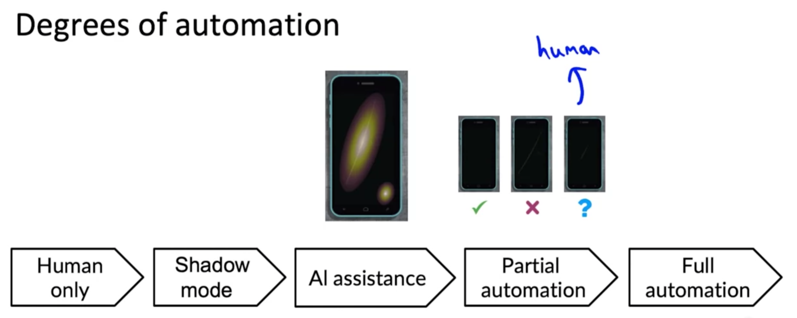
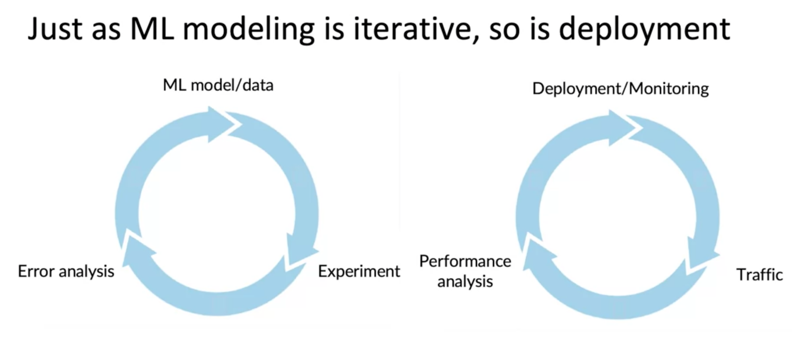
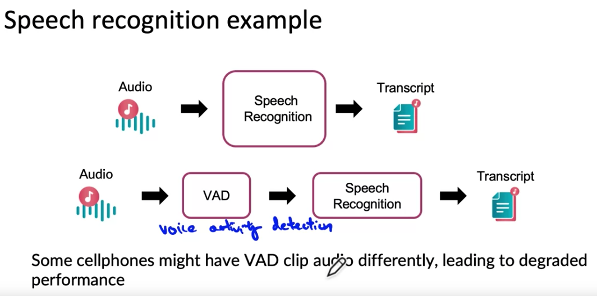

# Deployment

Two sources of issues: 1) Statistical and 2) Software.

## Concept drift and Data Drift  

What if the data (statistical distributions, meaning of data, types of photos/speech receiving) changes after the model has been deployed.  Concept drift usually refers to the relationship X (i.e., the model dataset) and Y(Target) changes. Data drift usually refers to the feature distribution changing.

- There are gradual and sudden (shock) changes
- Another example of Concept drift, let's say that `x` is the size of a house, `y` is the price of a house, and you're trying to estimate housing prices. If because of inflation or changes in the market, houses may become more expensive over time. The same size house, will end up with a higher price. That would be Concept drift. Maybe the size of houses haven't changed, but the price of a given house changes. Whereas data drift would be if, say, people start building larger houses, or start building smaller houses and thus the input distribution of the sizes of houses actually changes over time. When you deploy a machine learning system, **one of the most important tasks, will often be to make sure you can detect and manage any changes.**
- Concept drift, which is when the definition of what is y given x changes. As well as Data drift, which is if the distribution of x changes, even if the mapping from x or y does not change.

## Software Engineering Issues

**Design Question for implementing the prediction service**

- RealTime or Batch
- Where is the prediction server: In the cloud, on the edge device (e.g., phone, tablet), or even on the browser (e.g., Chrome, Firefox)?
- Compute Resources (CPU/GPU/Memory) and how that relates to cost
- Latency and Throughput (example metric: Query per second aka QPS)
- Logging (analysis and review)
- Security and privacy (what is the design and how do you meet the standard)

## ML Deployment Software Use Cases

1. New product / capability using ML
2. ML Automates / Assists with Manual task
    - when deploying, you would often deploy in `shadow mode`.  ML system shadows the human and runs in paralle.  ML system's output not used for any decisions during this phase (human choice will be used).  Really just comparing performance in real world situation.
3. Replace previous ML system

Key deployment design ideas: 1) `Gradual ramp up` with monitoring and 2) allow for `Rollback`

## Deployment Patterns (DevOps)

### Canary Deployment

Rollout ML based decisions to small fraction (say 5%) of traffic initially.  Monitor system and ramp up traffic gradually.

### Blue Green Deployment

In a blue green deployment, what you do is have the router send images to the old or the blue version and have that make decisions. And then when you want to switch over to the new version, what you would do is have the router stop sending images to the old one and suddenly switch over to the new version. So the way the blue green deployment is implemented is you would have an old prediction service may be running on some sort of service. You will then spin up a new prediction service, the green version, and you would have the router suddenly switch the traffic over from the old one to the new one. The advantage of a blue green deployment is that there's an easy way to enable rollback. If something goes wrong, you can just very quickly have the router go back reconfigure their router to send traffic back to the old or the blue version, assuming that you kept your blue version of the prediction service running.

In a typical implementation of a blue green deployment, people think of switching over the traffic 100% all at the same time. But of course you can also use a more gradual version where you slowly send traffic over.

## Degrees of Automation (A framework for understanding ML application)

How much is the human in the loop when it comes to the decision about the outcome variable?  `Human only` through `AI Assistance` means the human makes the decision.  `AI Assistance` highlights the issue (e.g., I think these are scratches) or makes a recommendation, but the human has to say what the final decision is.  `Partial Automation` means the ml model makes the decision on things it is highly confident on, but the human makes the decisions on decision the ml model is not confident on. Full automation: the ml model makes all the decisions (and these decisions are received by clients) without human intervention or oversight. `AI Assistance` and `Partial Automation` are examples of **human in the loop** deployment.

## Monitoring

- Monitoring Dashboard helpful for monitoring
    - What to monitor?
        - brainstorm everything that could go wrong, and select the most critical to monitor
        - brainstorm a few statistics/metrics that will detect that problem (may have to do this in gyroscope admin/db)
            - Software metrics: Memory, compute, latency, throughput, server load
            - Input metric: has the input disbution of features changed? Data quality changed?
            - Output metrics: What are the outputs of the model? Expect rates / ranges met?  Does output have data quality issues (e.g., producing nulls)?  Use responses to your prediction (are there behavior patterns that might indicate the use does/doesn't trust your prediction)?
    - Dashboard for Data Quality, Dashbord for Model Performance and run
    - You want metrics to monitor that detect changes.
    - You also want to know how quickly does the data change
        - Enterprise data (B2B applications) can shift fast because of policy or business decisions.  User data generally has slower drift

## Pipeline Monitoring (Orchestration)

To create your production system, you might have multiple ml models producing predictions.  How do you coordinate these steps, and how might performance changes (or model changes) on one model affect another model?

And the typical way that the user profile is built is with a learning algorithm to try to predict if this user of the car. This type of user profile, which can have a very long list of predicted attributes, can then be fed to recommend a system. Another learning algorithm that then takes this understanding of the user to try to generate product recommendations. Now, if something about the click stream data changes, maybe this input distribution changes, then maybe over time if we lose our ability to figure out if a user owns a car, then the percentage of the unknown tag here may go up. And because the user profiles output changes, the input to the recommended system now changes and this might affect the quality of the product recommendations. When you have a machine learning pipelines, these cascading effects in the pipeline can be complex to keep track on. But if the percentage of unknown labels does go up, this could be something that you want to be alerted to so that you can update the recommend the system if needed to make sure you continue to generate high quality product recommendations.

## References

- [Data and Concept Drift](https://towardsdatascience.com/machine-learning-in-production-why-you-should-care-about-data-and-concept-drift-d96d0bc907fb)
- [Monitoring Machine Learning Models in Production](https://christophergs.com/machine%20learning/2020/03/14/how-to-monitor-machine-learning-models/)
- [From Model-centri to Data-centric AI](https://www.youtube.com/watch?v=06-AZXmwHjo)
- Konstantinos, Katsiapis, Karmarkar, A., Altay, A., Zaks, A., Polyzotis, N., … Li, Z. (2020). Towards ML Engineering: A brief history of TensorFlow Extended (TFX). 
http://arxiv.org/abs/2010.02013 
- Paleyes, A., Urma, R.-G., & Lawrence, N. D. (2020). Challenges in deploying machine learning: A survey of case studies. 
http://arxiv.org/abs/2011.09926