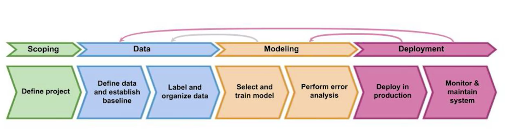
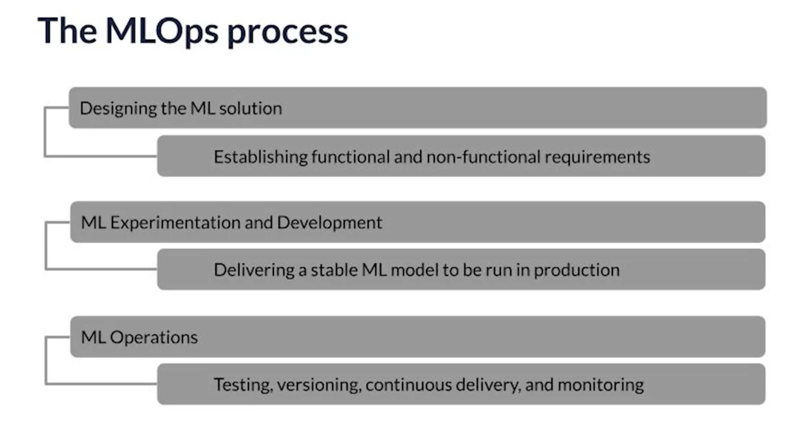
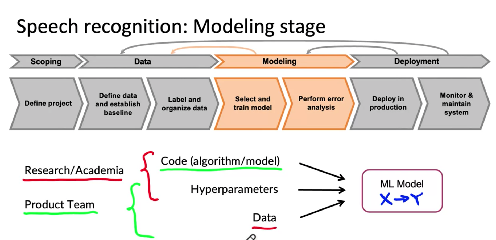
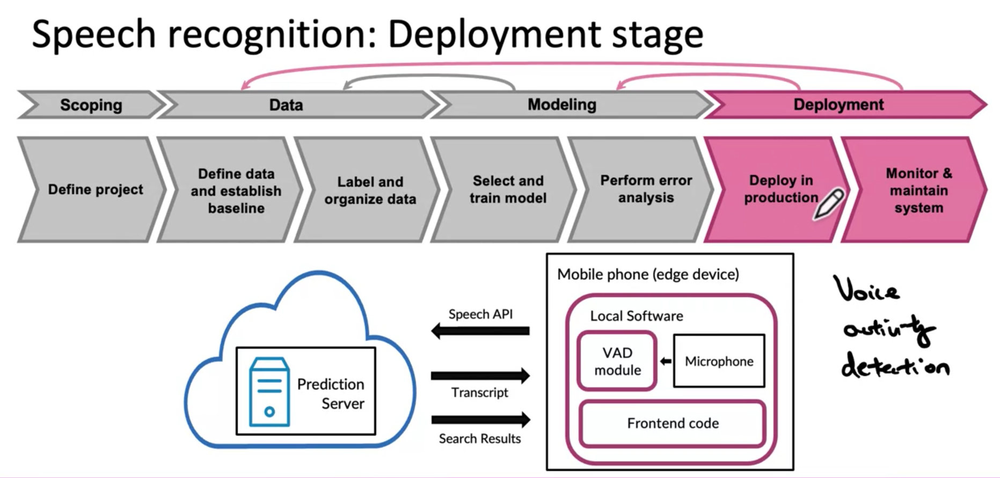
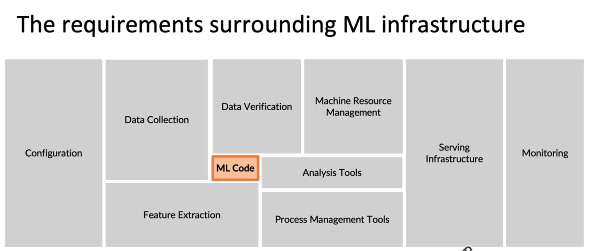

# MLOps

The discipline of building and maintaining production systems, that is the processes and tools for doing all this is sometimes called MLOps or Machine Learning Operations.

MLOps deals with change. As you said Andrew, in addition to building a first working model in a production system, you need to handle a whole range of issues, including things like data drift, where the distribution of the data you trained on maybe eventually become different, very different from the distribution of the data that you're running inference on. A key topic that we'll discuss is **change**. **The world changes and your model needs to be aware of that change.**

You can look at production machine learning as both machine learning itself and the knowledge and skills required in modern software development. If you're working on a machine learning team and industry, you really need expertise in both machine learning and software to be successful. **This is because your team will not just be producing a single result. You'll be developing a product or service that will operate continuously and maybe a mission critical part of your company's work.**

## MLOps Stages

## The MLOps Process

One common misconception is that the only difference between developing a model that you fit the notebook on your local machine and deploy that model into production is literally just the deployment piece, maybe just a bunch of software engineering. But that's not true, is not just a bunch of software engineering. There are machine learning challenges to production as well that on edges in the process of developing a model in a Jupyter notebook.

1. Scoping Stage: Define the problem, how are you going to approach the problem, what the evaluation metrics.
2. Data Stage: All about standardization and normalization (e.g., coding values, data rules, what is outcome variable and how is that labelled), and understanding the distribution.
3. Modeling: Selecting algorithm, tuning, determining & transforming the normalized data into the model dataset. Also performing error analysis, simulation, validation on model and updating model if needed.
4. Deployment - Serving predictions to clients, and monitoring and maintaining those systems.

### Modeling Note

Note:  I found that in a lot of research work or academic work you tend to hold the data fixed and vary the code and may be vary the hyperparameters in order to try to get good performance. In contrast, I found that for a lot of product teams, if your main goal is to just build and deploy a working valuable machine learning system, I found that it can be even more effective to hold the code fixed and to instead focus on optimizing the data and maybe the hyperparameters, In order to get a high performing model, A machine learning system includes both codes and data and also hyperparameters that there maybe a bit easier to optimize than the code or data. 

And I found that rather than taking a model-centric view of trying to optimize the code to your fixed data set for many problems, you can use an open source implementation of something you download of Git-hub and instead just focus on optimizing the data.

Error analysis can then tell you where your model still falls short. And if you can use that error analysis to tell you how to systematically improve your data, maybe improve the code too.

And part of the trick is you don't want to just feel like you need to collect more data all the time because we can always use more data. But rather than just trying to collect more and more and more data, which is helpful but can be expensive if their analysis can help you be more targeted in exactly what data to collect, that can help you'd be much more efficient in building an accurate model.

### Deployment Example

This is how you might deploy a speech system. You have a mobile phone. This would be an edge device with software running locally on your phone. That software taps into the microphone to record what someone is saying. Maybe for voice search and in a typical implementation of speech recognition, you would use a VAD module. VAD stands for a voice activity detection.

Maybe a learning algorithm and the job of the VAD allows the smartphone to select out just the audio that contains hopefully someone speaking so that you can send only that audio clip to your prediction server. And in this case maybe the prediction server lives into cloud.

The prediction server then returns both the transcript so the user, so you can see what the system thinks you said. And it also returns to search results. If you're doing voice search and the transcript and search results are then displayed in the front and code running on your mobile phone. So implementing this type of system would be the work needed to deploy a speech model in production even after it's running though you still have to monitor and maintain the system.

### Concept and Data Drift

Happens when the data distribution changes, such as there are more and more young voices being fed to the speech recognition system. And knowing how to put in place appropriate monitors to spot such problems and then also how to fix them in a timely way is a key skill needed to make sure your production deployment creates a value you hope it will.

## ML Infrastructure

ML Code is the model code.