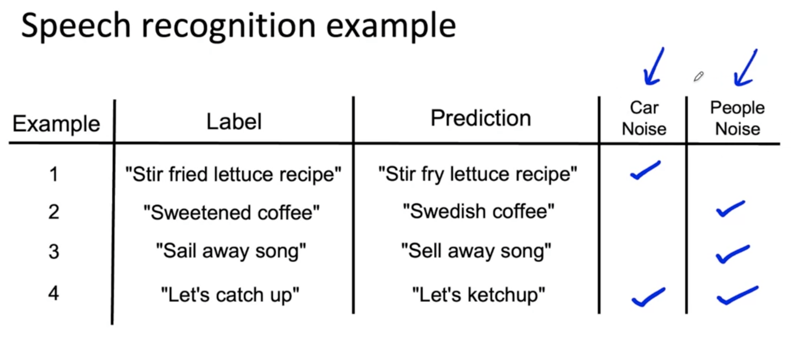
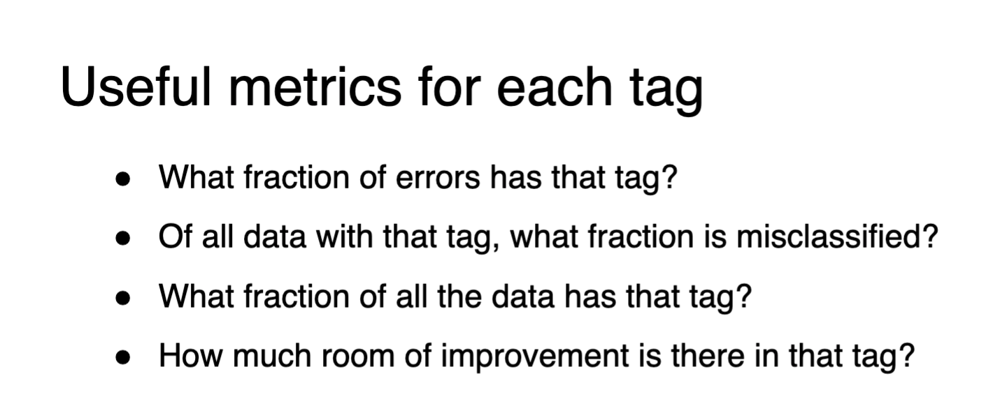

# Overview

## Notes

- [Week 2 Notes](./readings/C1_W2.pdf)

protected attributes example: ethnicity, gender, location, & language.
What are the implications of your model?  Is it fair? Does it discriminate?

## Establishing a baseline

Human baseline could be an easy way to make a baseline. Because humans are so good at unstructured data tasks, measuring human level performance or HLP, is often a good way to establish a baseline if you are working on **unstructured data**.

Because humans are not as good at looking at data like this to make predictions. We certainly didn't evolve to look at giant spreadsheets. Human level performance is usually a less useful baseline for structured data applications.

### Ways of establishing a baseline

Should be focused on your problem that you are trying to solve and using data similar to yours.

1. Human level performance (HLP)
2. Literature Search for state-of-the-art/open source
3. Quick and dirty implementation to explore the possibility
4. Performance of the previous system

 What a baseline system or a baseline level of performance does is it helps to indicate what might be possible. In some cases, such as if you're using human level performance, especially on unstructured data problems, this baseline can also give you a sense of what is the irreducible error or what is Bayes error. In other words, what is the best that anyone could possibly hope for in terms of performance on this problem, such as helping us realize that maybe the low bandwidth audio is so bad that is just not possible to have more than 70 percent accuracy, as in our earlier example. By helping us to get a very rough sense of what might be possible, it can help us be much more efficient in terms of prioritizing what to work on.

### Practice advice about training model

- Try to overfit on a small dataset.  So take one example and train it and see if there is anything promising.

The advantage of this is you may be able to train your algorithm on one or a small handful of examples in just minutes or maybe even seconds and this lets you find bugs much more quickly. Finally, for image classification problems, even if you have 10,000 images or 100,000 images or a million images in your training set, it might be worthwhile to very quickly train your algorithm on a small subset of just 10 or maybe 100 images, because you can do that quickly. If your algorithm can't even do well on 100 images, well, then it's clearly not going to do well on 10,000 images, so this would be another useful sanity check for your code.

## Error Analysis

So I think of the heart of the machine learning development process as error analysis, which if you do it well, I can tell you what's the most efficient use of your time in terms of what you should do to improve your learning algorithm's performance.

Take mislabeled or incorrect prediction, and explore if there are systematic reasons in the data that may explain why the model is getting things wrong.

As you go through these different tags here are some useful numbers to look at. First what fraction of errors have that tag? For example, if you listen to 100 audio clips and find that 12% of them were labeled with the car noise type, then that gives you a sense of how important is it to work on car noise. It tells you also that even if you fix all of the car noise issues, the performance may improve only by 12%, which is actually not bad.

